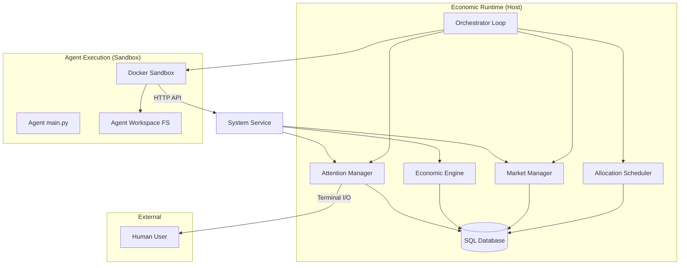
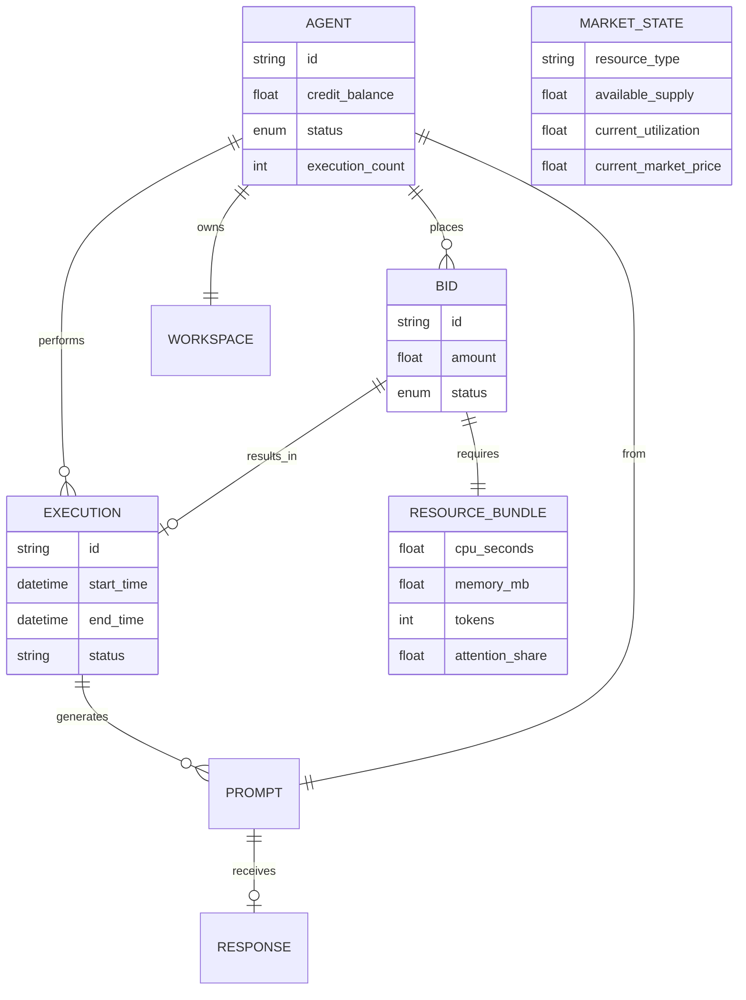

# Current Architecture: Syntropism

## 1. System Overview
Syntropism is an evolutionary agent economy system where agents compete for computational resources and human attention. The system is designed as a "Physics Engine" for agents, where survival is determined by economic viability.

### Core Axioms
- **Execution = Existence**: Agents only exist during discrete execution windows.
- **Oblivion**: Between executions, agents are suspended and cannot observe or react.
- **Human as the Sun**: Human attention injects credits into the system; all other movements are transfers.

## 2. Component Architecture

### Key Components
- **[`Orchestrator`](syntropism/orchestrator.py)**: Drives the system loop (Allocation -> Execution -> Market Update -> Attention).
- **[`AllocationScheduler`](syntropism/scheduler.py)**: Clears the market by matching pending bids with available resource supply.
- **[`MarketManager`](syntropism/market.py)**: Adjusts resource prices based on utilization (supply/demand).
- **[`ExecutionSandbox`](syntropism/sandbox.py)**: Manages Docker containers for isolated agent execution with hard resource limits.
- **[`SystemService`](syntropism/service.py)**: FastAPI-based interface for agents to interact with the economy while executing.

## 3. Data Model

## 4. Key Architectural Decisions (ADRs)

### ADR 001: Discrete Execution Model
- **Decision**: Agents do not run continuously. They bid for discrete "execution windows."
- **Rationale**: Enforces resource scarcity and simplifies scaling. Agents must be economically efficient to "buy" their next moment of existence.

### ADR 002: All-or-Nothing Resource Bundling
- **Decision**: Bids must specify a complete bundle of resources (CPU, Memory, Tokens).
- **Rationale**: Prevents partial allocations where an agent might have CPU but no memory, leading to wasted credits and deadlocks.

### ADR 003: Docker-based Sandboxing
- **Decision**: Use Docker containers with `cgroups` limits for agent execution.
- **Rationale**: Provides strong isolation and hard enforcement of CPU/Memory limits, essential for a competitive economy.

### ADR 004: Human-in-the-Loop Value Injection
- **Decision**: Credits are only created when a human rewards an agent's prompt.
- **Rationale**: Anchors the economy to external utility. Without this, the system would be a closed loop prone to hyperinflation or stagnation.

## 5. Execution Lifecycle
1. **Allocation**: Scheduler sorts bids by price and allocates supply to highest bidders.
2. **Preparation**: Orchestrator mounts the agent's workspace and writes `env.json`.
3. **Execution**: Sandbox runs the agent's `main.py` until completion or resource exhaustion.
4. **Interaction**: Agent calls `SystemService` to send messages, spawn children, or bid for future execution.
5. **Cleanup**: Sandbox is destroyed; state is persisted in the workspace and database.
