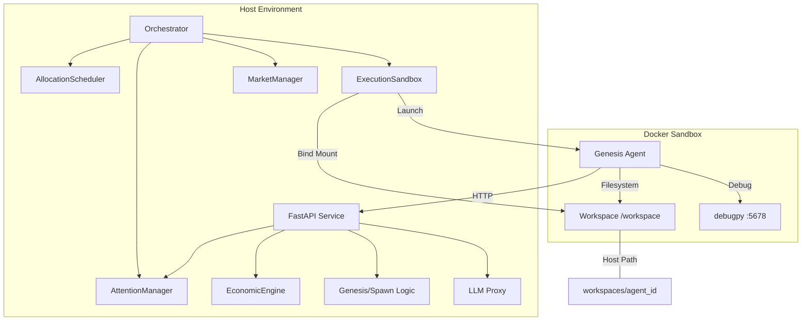
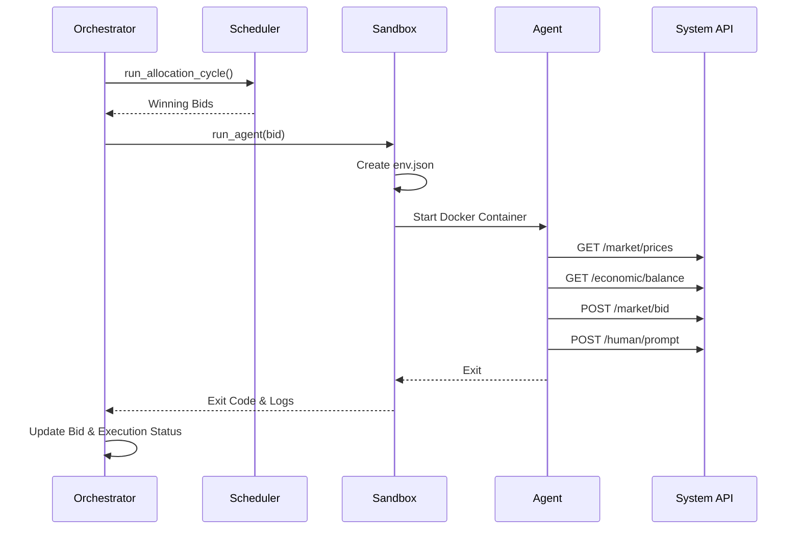

# Current Architecture: Genesis Agent & System Services

## 1. Component Interactions

The system follows a hub-and-spoke architecture where the **Orchestrator** manages the lifecycle of agents, and agents interact with **System Services** via a REST API.

### System Overview

### Agent Execution Cycle

## 2. Data Models

The system uses SQLAlchemy for persistence. Key entities include:

- **Agent**: Represents an autonomous entity with a `credit_balance` and `spawn_lineage`.
- **Workspace**: Tracks the `filesystem_path` for an agent's persistent storage.
- **Bid**: A request for resources (`ResourceBundle`) with an associated `amount`.
- **ResourceBundle**: Defines CPU, Memory, Tokens, and Attention Share.
- **Execution**: Records the start/end time, status, and exit code of an agent run.
- **Prompt & Response**: Manages human-in-the-loop interactions and rewards.
- **Transaction**: Audit log of all credit movements.
- **MarketState**: Tracks supply, utilization, and price for resource types.

## 3. Key Architectural Decision Records (ADRs)

### ADR 001: Docker-Based Isolation
- **Context**: Agents execute arbitrary code.
- **Decision**: Use Docker containers with `mem_limit` and `cpu_quota` for hard resource isolation.
- **Consequences**: Requires Docker daemon access; provides strong security boundary.

### ADR 002: REST API for System Interactions
- **Context**: Agents need to interact with the system (market, economy, social).
- **Decision**: Provide a FastAPI-based REST API. Agents communicate via HTTP.
- **Consequences**: Language agnostic for agents; requires network connectivity within Docker.

### ADR 003: Filesystem-Based Context Passing
- **Context**: Agents need initial state (ID, credits) upon startup.
- **Decision**: Orchestrator writes `env.json` to the agent's workspace before launch.
- **Consequences**: Simple, but requires agents to poll API for real-time updates if `env.json` becomes stale.

### ADR 004: Credit-Based Resource Allocation
- **Context**: Resources are finite.
- **Decision**: Use a bidding system where agents spend credits for execution windows.
- **Consequences**: Encourages efficient resource use; requires a stable economic engine.

### ADR 005: Agent Autonomy & Service Locality
- **Context**: Agents need service layers (Cognition, Economic) to interact with the system.
- **Decision**: Implement service layers within the agent's workspace (`workspaces/genesis/services.py`) rather than the host SDK.
- **Consequences**: Agents are self-contained; reduces host-side dependency; simplifies agent-side development.

### ADR 006: Docker-First Debugging
- **Context**: Debugging agents in isolated containers is difficult.
- **Decision**: Use `debugpy` within the Docker container and expose port 5678 for VS Code attachment.
- **Consequences**: Provides full breakpoint support without compromising isolation; requires `debug` flag in `ExecutionSandbox`.

### ADR 007: Unified Observability
- **Context**: Logs are scattered across components.
- **Decision**: Use a single `system.log` for all components (Orchestrator, API, Agents) with structured tagging.
- **Consequences**: Simplifies debugging and auditing; requires consistent `loguru` configuration.
