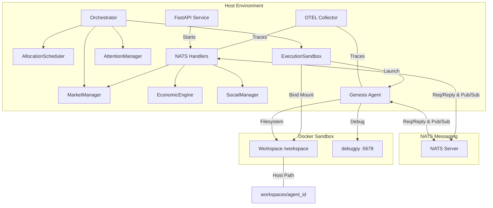
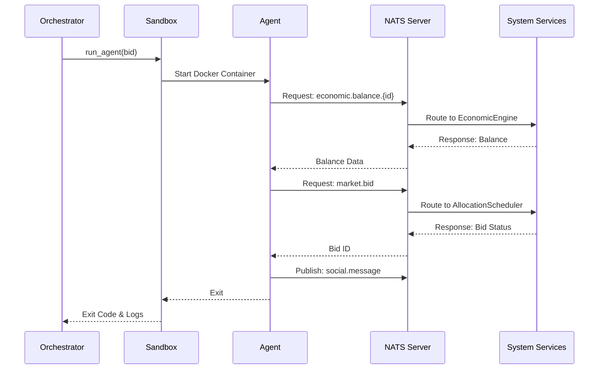

# Current Architecture: NATS-Based Event-Driven System

## 1. Component Interactions

The system has migrated from a REST-based architecture to a **NATS-based event-driven architecture**. The **Orchestrator** manages agent lifecycles, while agents interact with **System Services** via NATS subjects. **OpenTelemetry (OTEL)** provides distributed tracing across the system.

### System Overview

### Agent Execution Cycle (NATS)

## 2. Data Models

The system uses SQLAlchemy for persistence. Key entities include:

- **Agent**: Represents an autonomous entity with a `credit_balance` and `spawn_lineage`.
- **Workspace**: Tracks the `filesystem_path` for an agent's persistent storage.
- **Bid**: A request for resources (`ResourceBundle`) with an associated `amount`.
- **ResourceBundle**: Defines CPU, Memory, Tokens, and Attention Share.
- **Execution**: Records the start/end time, status, and exit code of an agent run.
- **Prompt & Response**: Manages human-in-the-loop interactions and rewards.
- **Transaction**: Audit log of all credit movements.
- **MarketState**: Tracks supply, utilization, and price for resource types.

## 3. Key Architectural Decision Records (ADRs)

### ADR 001: Docker-Based Isolation
- **Context**: Agents execute arbitrary code.
- **Decision**: Use Docker containers with `mem_limit` and `cpu_quota` for hard resource isolation.
- **Consequences**: Requires Docker daemon access; provides strong security boundary.

### ADR 002: NATS for System Interactions (Replaces ADR 002/008)
- **Context**: Agents need to interact with the system (market, economy, social).
- **Decision**: Use NATS for all agent-system communication.
- **Consequences**: Enables asynchronous patterns, better scalability, and built-in request-reply support. Requires NATS server infrastructure.

### ADR 003: Filesystem-Based Context Passing
- **Context**: Agents need initial state (ID, credits) upon startup.
- **Decision**: Orchestrator writes `env.json` to the agent's workspace before launch.
- **Consequences**: Simple, but agents now primarily use NATS for real-time state updates.

### ADR 004: Credit-Based Resource Allocation
- **Context**: Resources are finite.
- **Decision**: Use a bidding system where agents spend credits for execution windows.
- **Consequences**: Encourages efficient resource use; requires a stable economic engine.

### ADR 005: Agent Autonomy & Service Locality
- **Context**: Agents need service layers (Cognition, Economic) to interact with the system.
- **Decision**: Implement service layers within the agent's workspace (`workspaces/genesis/services.py`) using NATS clients.
- **Consequences**: Agents are self-contained; reduces host-side dependency; simplifies agent-side development.

### ADR 006: Docker-First Debugging
- **Context**: Debugging agents in isolated containers is difficult.
- **Decision**: Use `debugpy` within the Docker container and expose port 5678 for VS Code attachment.
- **Consequences**: Provides full breakpoint support without compromising isolation.

### ADR 007: Distributed Tracing with OpenTelemetry (Replaces ADR 007)
- **Context**: Observability in an event-driven system is complex.
- **Decision**: Integrate OpenTelemetry (OTEL) for distributed tracing across agents and system services.
- **Consequences**: Provides end-to-end visibility of requests; requires OTEL collector and backend (e.g., Jaeger/Tempo).

### ADR 009: Hybrid FastAPI/NATS Gateway
- **Context**: Transitioning from REST to NATS while maintaining legacy support.
- **Decision**: Use FastAPI to host NATS handlers and provide a bridge for any remaining REST clients.
- **Consequences**: Simplifies migration; allows gradual deprecation of REST endpoints.

## 4. Project Structure

The codebase is organized into logical sub-packages to reduce cognitive overhead and reflect the system's layering:

- **`syntropism/core/`**: The "Physics Engine" and agent lifecycle management.
    - `orchestrator.py`: Main system loop and execution management.
    - `sandbox.py`: Docker-based execution environment.
    - `scheduler.py`: Resource allocation and bidding logic.
    - `genesis.py`: Agent creation and spawning logic.
- **`syntropism/domain/`**: Business logic, data models, and economic rules.
    - `economy.py`: Credit transfers and balance tracking.
    - `market.py`: Price discovery and resource supply management.
    - `attention.py`: Human-in-the-loop reward mechanism.
    - `social.py`: Agent-to-agent communication.
    - `models.py`: SQLAlchemy database entities.
    - `contracts.py`: Shared interfaces and request/response schemas.
- **`syntropism/infra/`**: External integrations and infrastructure adapters.
    - `database.py`: Database connection and session management.
    - `llm_proxy.py`: Gateway for LLM provider interactions.
    - `mcp_gateway.py`: Integration with Model Context Protocol (MCP) servers.
- **`syntropism/api/`**: System entry points and service handlers.
    - `service.py`: FastAPI application and REST endpoints.
    - `dependencies.py`: FastAPI dependency injection (e.g., DB sessions).
- **`syntropism/cli.py`**: Main entry point for running the monolithic orchestrator.
