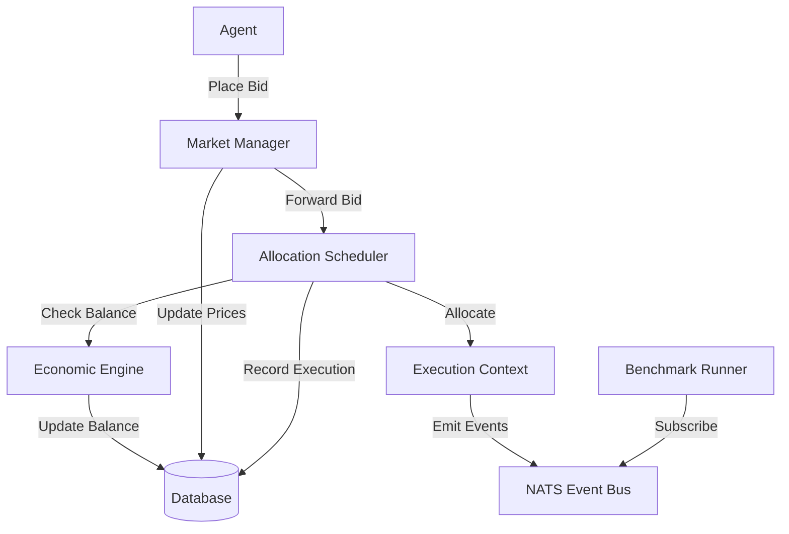
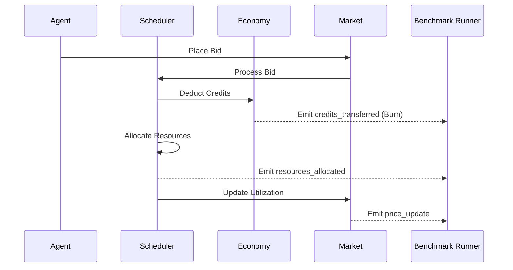

# Current Architecture

## Overview
The Syntropism system is an agent-based economic simulation where agents compete for scarce resources (CPU, Memory, Tokens, Attention) using a credit-based currency. The system is designed to be event-driven, using NATS for inter-service communication and OpenTelemetry for observability.

## Resource Definitions & Scarcity
Resources are defined by their availability over time, adhering to the "Physics of Scarcity":
- **Time-Based Allocation**: Resources are priced and allocated per unit time (e.g., % of max capacity for a specific duration).
- **LLM Scarcity**: LLM utilization is capped by a system-wide maximum spend per unit time, treating commercial API costs as a finite physical resource.
- **Attention**: A finite resource representing human or system focus, priced and allocated alongside compute.

## System Components

### 1. Economic Engine (`syntropism/domain/economy.py`)
Manages the credit ledger, agent balances, and transactions.
- **Responsibilities**: Credit transfers, balance queries, transaction history.
- **Invariants**: Conservation of credits (except for human rewards and resource burning).

### 2. Market Manager (`syntropism/domain/market.py`)
Handles resource pricing and market state.
- **Responsibilities**: Dynamic price updates based on utilization, providing market state via NATS.
- **Pricing Logic**: Simple linear adjustment based on high/low utilization thresholds.

### 3. Allocation Scheduler (`syntropism/core/scheduler.py`)
Coordinates resource allocation through a bidding process.
- **Responsibilities**: Processing bids, sorting by price, allocating resources based on supply, updating market utilization.
- **Mechanism**: Highest-bidder-first allocation within supply constraints.

### 4. Benchmark Runner (`syntropism/benchmarks/runner.py`)
Evaluates agent performance against predefined scenarios.
- **Responsibilities**: Collecting events from NATS, validating event sequences against scenario requirements.
- **Status**: Currently lacks full integration with the event taxonomy defined in design docs.

## Data Flow & Interaction

## Event Flow (Target)

## Current Misalignments

### 1. Event Emission
- **Design**: `docs/design/10_agent_benchmark.md` specifies a rich taxonomy of events (`bid_placed`, `resources_allocated`, `price_update`, etc.).
- **Implementation**: Current code has minimal event emission. `BenchmarkRunner` listens to `benchmark_events` but the core logic (Scheduler, Economy, Market) does not yet emit these specific events to NATS.

### 2. Resource Pricing
- **Design**: `docs/design/03_market.md` calls for "Physics of Scarcity" and "Supply and Demand Dynamics".
- **Implementation**: `MarketManager` uses a basic threshold-based price adjustment. It lacks the sophisticated supply/demand curves and "Attention" pricing described in the design.

### 3. Credit Flow
- **Design**: `docs/design/02_money.md` specifies that credits spent on resources should be **Burned**.
- **Implementation**: `AllocationScheduler` deducts credits from the agent balance. While not explicitly transferred to a "burn" account, the credits are removed from the agent's balance, effectively removing them from the active agent economy.

### 4. Benchmark Data
- **Status**: Benchmark data files (e.g., `er001.json`) are currently empty or minimal. They need to be populated with the `required_event_sequence` matching the taxonomy in `10_agent_benchmark.md`.
