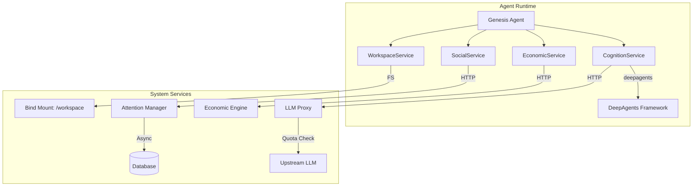

# Future Architectural Direction: Genesis Agent API Implementation

**Date**: 2026-02-08
**Status**: Proposed

## 1. Overview
The Genesis Agent will transition from a script making direct HTTP calls to a domain-driven architecture utilizing specialized service layers. This alignment ensures the agent remains autonomous, economically aware, and socially integrated while abstracting system complexities.

## 2. Proposed Agent Service Layer Implementation
These layers are how the agent itself is defined. The agent lives in its workspace at workspaces/genesis. All of its code other than python dependencies lives there. Not via an sdk maintained in the host project. Not in the runtime. In its workspace.
### A. Cognition Layer (`CognitionService`)
- **Implementation**: Wrapper around the `deepagents` framework.
- **Responsibility**: Manages the agent's "inner monologue," planning, and tool execution.
- **Key Change**: Move from hardcoded logic in `workspaces/genesis/main.py` to a structured `invoke()` cycle.

### B. Economic Layer (`EconomicService`)
- **Implementation**: Python client library for the `EconomicEngine`.
- **Responsibility**: Encapsulates credit balance checks and bidding logic.
- **Key Change**: Standardize `place_bid()` to handle resource bundle negotiation automatically.

### C. Social Layer (`SocialService`)
- **Implementation**: Asynchronous communication bridge.
- **Responsibility**: Handles `prompt_human()` without blocking the system orchestrator.
- **Key Change**: Replace blocking `input()` with a message-queue-based attention system.

### D. Workspace Layer (`WorkspaceService`)
- **Implementation**: Secure filesystem abstraction.
- **Responsibility**: Mediates all file I/O and code execution within the `/workspace` sandbox.
- **Key Change**: Enforce path validation and audit logging for every operation.

## 3. System-Level Changes

### LLM Proxy & Token Enforcement
- **New Component**: `SystemLLMProxy` service.
- **Function**: Intercepts all LLM requests from agents, injects system prompts, enforces token quotas, and logs interactions for the audit trail.

### Asynchronous Attention Management
- **Refactor**: Move `AttentionManager` logic out of the main orchestrator loop.
- **Mechanism**: Use a persistent `Prompt` table as a mailbox. Agents post prompts; humans respond via the existing CLI interaction system; agents poll or receive callbacks for responses.

## 4. Debuggability & Observability (MVS Requirements)

### A. Local Execution Mode ("No-Docker")
- **Requirement**: The `ExecutionSandbox` must support a `local` mode that runs agents as host subprocesses.
- **Purpose**: Enables direct VSCode debugging (breakpoints, variable inspection) within `workspaces/genesis/main.py` without container overhead.
- **Constraint**: Docker remains the primary production runtime; local mode is for development/debugging only.

### B. Unified Debugging Configuration
- **Requirement**: Provide a `.vscode/launch.json` that allows starting the Orchestrator, System API, and a target Agent in a single debug session.

### C. Unified System Log
- **Requirement**: Implement structured logging using `loguru` that aggregates events from the Orchestrator, API, and Agent Services into a single, tail-able `system.log`.
- **Content**: Must include "thoughts" from `CognitionService`, financial transactions from `EconomicService`, and social prompts.

## 5. Implementation Roadmap

1.  **Phase 1: Service Abstractions**: Create the Python base classes for `Cognition`, `Economic`, `Social`, and `Workspace` services in the `workspaces/genesis/` environment.
2.  **Phase 2: LLM Proxy**: Implement the `/llm` endpoint in `syntropism/service.py` to route requests to the configured provider.
3.  **Phase 3: Async Social**: Refactor `AttentionManager` to use the database for non-blocking human-in-the-loop interactions.
4.  **Phase 4: Genesis Migration**: Rewrite `workspaces/genesis/main.py` to use the new service layers.

## 6. Mermaid Diagram: Future State

