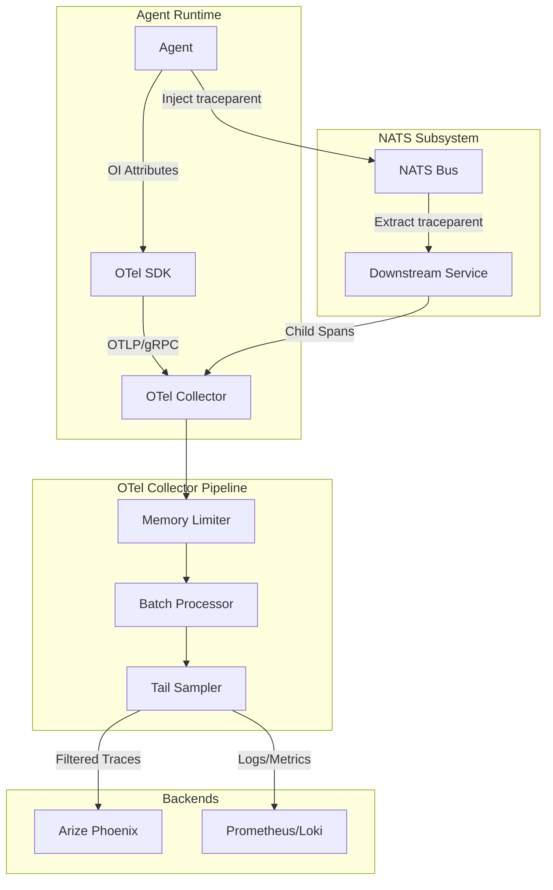

# Architectural Recommendations

## Scalability
- **NATS JetStream for Event Persistence**: Transition from standard NATS pub/sub to JetStream. This ensures that benchmark events are not lost if the `BenchmarkRunner` is temporarily disconnected and allows for "replay" of scenarios.
- **Asynchronous Price Updates**: Move `MarketManager.update_prices` out of the request-response cycle and into a background worker or a scheduled NATS task to prevent blocking resource allocation.
- **Database Indexing**: Ensure `Transaction` and `Bid` tables have composite indexes on `(agent_id, timestamp)` to support fast history and audit queries as the number of agents grows.

## Security
- **Atomic Transactions**: Ensure all credit transfers and resource allocations use strict database transactions (ACID) to prevent double-spending or resource over-allocation. The current `AllocationScheduler` uses `session.commit()` but needs careful error handling to ensure atomicity across multiple resource types.
- **Agent Isolation**: Implement strict workspace isolation (already hinted at in `models.py`) to ensure agents cannot access each other's files or the system's internal state except through authorized NATS subjects.
- **Validation of Bids**: Implement server-side validation of bid amounts against current balances *before* entering the allocation cycle to reduce noise and potential DoS from invalid bids.

## Resilience
- **Circuit Breakers for LLM Proxy**: The `infra/llm_proxy.py` (referenced in file list) should implement circuit breakers to handle upstream provider failures without crashing the economic simulation.
- **Idempotent Event Emission**: Ensure that if a process restarts, it doesn't emit duplicate events for the same state change. Use `event_id` (UUID) as defined in `10_agent_benchmark.md` to deduplicate at the collector level.
- **Graceful Degradation**: If the `MarketManager` is unavailable, the `Scheduler` should fall back to last-known prices rather than failing allocation.

## Maintainability
- **Centralized Event Registry**: Create a shared library or schema definition (e.g., using Pydantic) for all events defined in `10_agent_benchmark.md`. This ensures consistency between the emitters (Scheduler, Economy) and the consumer (BenchmarkRunner).
- **Dependency Injection**: Refactor `MarketManager` and `EconomicEngine` to use dependency injection for the NATS client and Database session, making unit testing easier without requiring live infrastructure.
- **Unified Logging and Tracing**: Expand the OpenTelemetry implementation in `economy.py` to cover the `Scheduler` and `MarketManager`, providing a full trace of a single bid from placement to allocation.

## Observability (OpenInference, OTel, NATS)

### Comparison against Industry Standards

| Standard | Current Implementation | Industry Standard / Best Practice | Gap |
| --- | --- | --- | --- |
| **OpenInference** | Basic OTel spans in `EconomicEngine`. Missing LLM-specific attributes. | Structured spans for prompts, completions, tool calls, and retrieval. | High: Missing semantic conventions for agent reasoning. |
| **Twelve-Factor App** | Hardcoded endpoints in `otel-collector-config.yaml`. | Factor III: Config via environment variables. Factor XI: Logs as event streams. | Medium: Config is static; logs are not yet integrated into OTel. |
| **OTel Scalability** | Direct export without processors. | Use of `batch`, `memory_limiter`, and `tail_sampling` processors. | High: Risk of OOM and network congestion under high agent load. |
| **Security** | Insecure OTLP export (`insecure: true`). | TLS for all data in transit. Authentication for collector and backend. | Medium: Data in transit is unencrypted. |
| **Resilience** | Basic `depends_on` in Docker. | Health checks, retries, and buffering in the collector. | Medium: No retry logic for failed exports. |

### Recommendations

#### Scalability
- **Implement OTel Processors**: Update `otel-collector-config.yaml` to include `batch` (to reduce network overhead), `memory_limiter` (to prevent OOM), and `resourcedetection` (to enrich spans with host metadata).
- **Tail Sampling**: Implement `tail_sampling` in the OTel collector to prioritize traces with errors or high latency, reducing the volume of "noise" from successful, low-latency agent loops.

#### Security
- **Enable TLS for OTLP**: Transition from insecure OTLP to TLS-encrypted exports.
- **Phoenix Authentication**: Configure Arize Phoenix with authentication (e.g., via a reverse proxy or built-in auth if available) to protect sensitive reasoning traces.

#### Resilience
- **Collector Health Checks**: Add health checks to the `otel-collector` service in `docker-compose.nats.yml` and configure the `health_check` extension in the collector config.
- **Export Retries**: Configure `retry_on_failure` and `sending_queue` in the OTLP exporter to handle transient network issues or Phoenix downtime.

#### Maintainability
- **OpenInference Standardization**: Create a standardized `ObservabilityProvider` or decorator that automatically injects OpenInference-compliant attributes (e.g., `llm.input_messages`, `tool.name`) into spans.
- **Log Integration**: Route application logs through the OTel collector using the `log` pipeline, allowing for correlation between traces and logs in Phoenix.
- **Environment-Based Config**: Use environment variable substitution in `otel-collector-config.yaml` to allow for different endpoints and sampling rates across dev/test/prod.

### Optimized Observability Architecture

