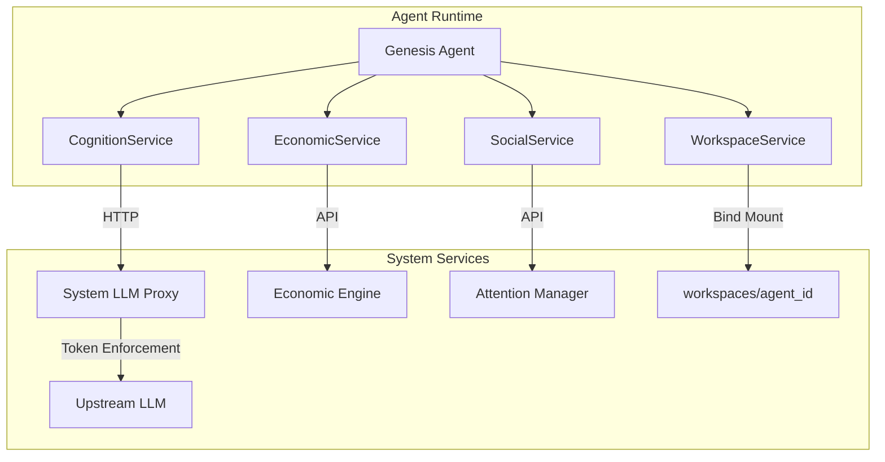

# Future Architectural Direction: Genesis Agent API Design
**Date**: 2026-02-08
**Status**: Agreed

## 1. Core Philosophy
The Genesis Agent is not just a script; it is an autonomous entity with distinct cognitive, economic, and social layers. The API design must reflect this by providing high-level abstractions that hide the complexity of the underlying system services.

## 2. Domain-Driven API Structure

### A. Cognition Layer (`CognitionService`)
Responsible for autonomous planning, multi-step reasoning, and task delegation using the `deepagents` framework.
- **`invoke(messages: List[Dict]) -> Dict`**: The primary entry point for the agent's cognitive cycle, processing messages and returning structured state.
- **`stream(messages: List[Dict]) -> Iterator[Dict]`**: Streams the agent's reasoning process and tool calls in real-time.
- **`write_todos(todos: List[str])`**: Built-in tool for breaking down complex goals into discrete, trackable steps.
- **`task(description: str, subagent_type: str)`**: Built-in tool for delegating specialized work to sub-agents (e.g., research, code review).

### B. Economic Layer (`EconomicService`)
Handles all financial and resource-related interactions.
- **`get_balance() -> float`**: Returns current credits.
- **`get_market_prices() -> Dict[str, float]`**: Returns current resource costs.
- **`place_bid(amount: float, resources: ResourceBundle) -> bool`**: Bids for the next execution window.

### C. Social Layer (`SocialService`)
Manages interactions with humans and potentially other agents.
- **`prompt_human(message: str) -> str`**: Sends a message to the human and waits for a response (if attention is allocated).
- **`broadcast(message: str)`**: Sends a public message to the system log.

### D. Workspace Layer (`WorkspaceService`)
Provides controlled access to the agent's persistent storage and execution environment.
- **`read_file(path: str) -> str`**: Reads a file from the workspace.
- **`write_file(path: str, content: str)`**: Writes/updates a file.
- **`execute_code(code: str) -> str`**: Runs Python code in a sub-process and returns output.

## 3. LLM Integration Strategy
- **System-Routed Calls**: All LLM interactions MUST be routed through the system's local API endpoint (e.g., `http://system/llm`). Direct access to upstream providers (OpenAI, Anthropic, etc.) is strictly prohibited.
- **Token Enforcement**: The system enforces token limits based on the agent's allocated resource bundle. The agent must handle `429 Too Many Requests` or similar errors when limits are exceeded.
- **Structured Output**: Use Pydantic models to enforce schemas on LLM responses, ensuring the agent's logic can reliably process "thoughts."
- **Context Management**: The `CognitionService` will manage a rolling window of execution logs and workspace state to provide relevant context to the LLM.

## 4. Workspace Management Strategy
- **Sandboxed FS**: All file operations are relative to `/workspace`.
- **Bind Mount**: The host directory `workspaces/<agent_id>` is bind-mounted to `/workspace` in the agent's runtime environment.
- **Layered Security**: DeepAgents' `FilesystemBackend` provides software-level path validation, while the system's Docker runtime provides kernel-level isolation.
- **Audit Logging**: Every file change and code execution is logged for transparency and debugging.
- **Resource Limits**: Code execution via `execute_code` is subject to the same resource constraints as the main agent process.

## 5. Runtime & Dependency Recommendations
To support this clean architecture, the `runtime/pyproject.toml` should be updated with:
- **`deepagents`**: Primary recommendation for autonomous agent logic, providing native support for planning, sub-agents, and filesystem-backed memory.
- **`langchain`**: For robust LLM orchestration and integration with the system's local API endpoint.
- **`pydantic`**: For data validation and structured LLM outputs.
- **`loguru`**: For structured, readable logging.
- **`tenacity`**: For robust retry logic on network calls (especially for token limit handling).
- **`sh`**: For clean, pythonic shell command execution.

## 6. System Interaction Architecture

